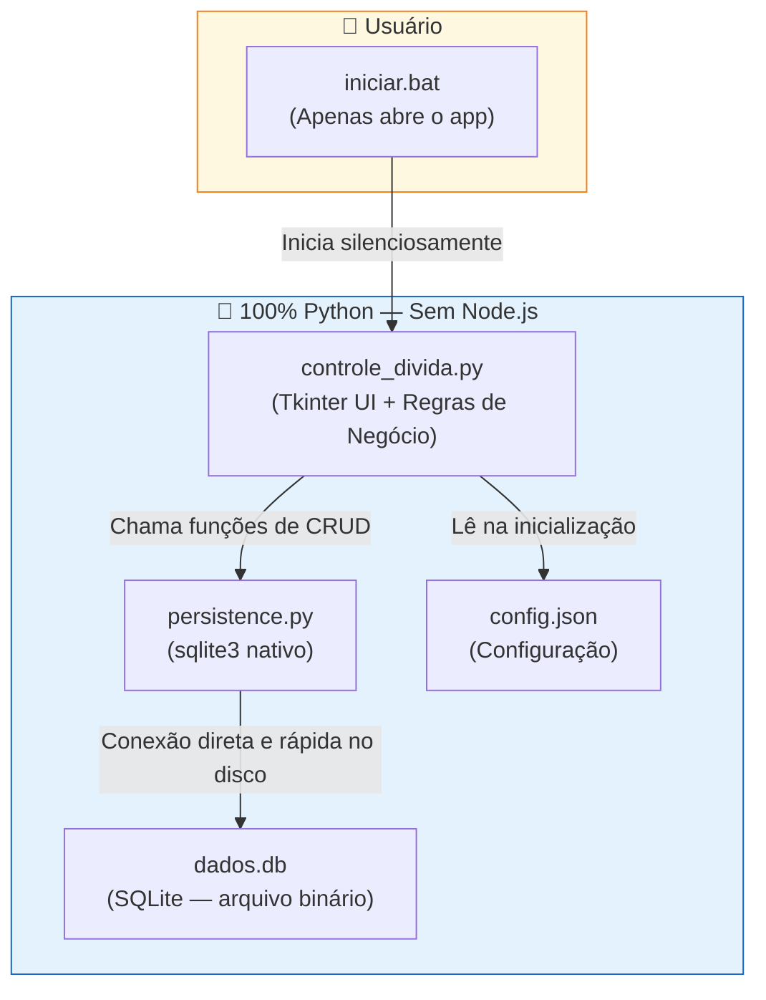
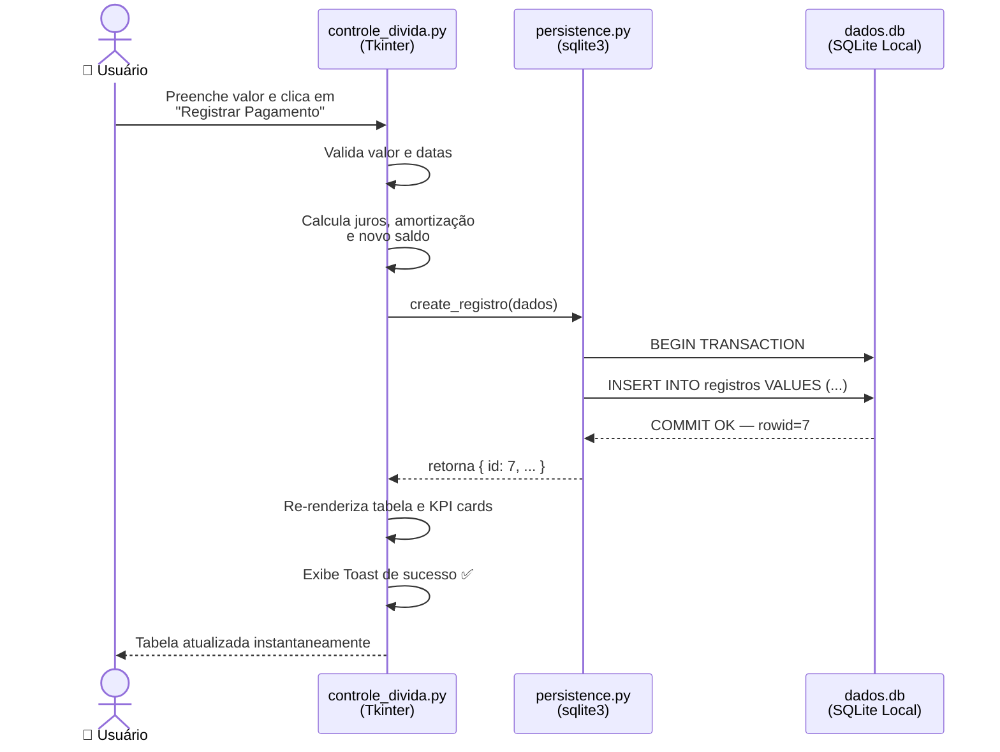
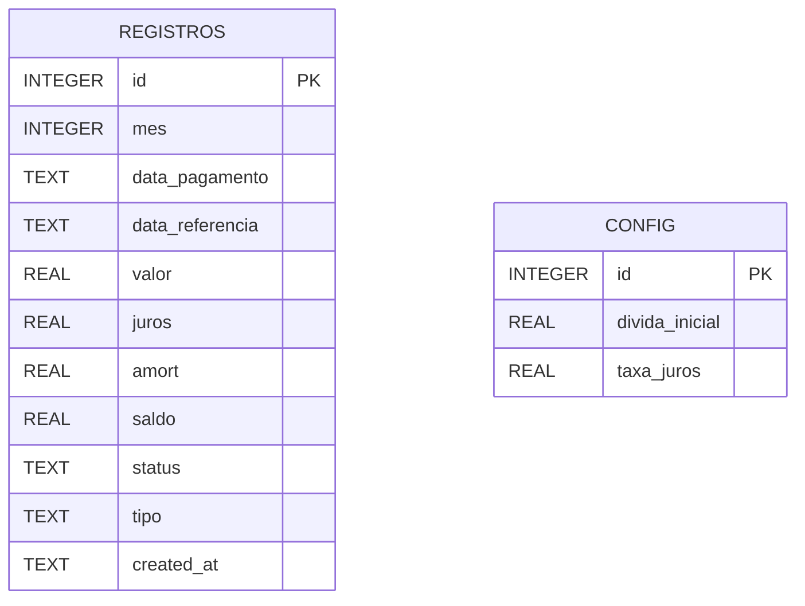

# Arquitetura Atual (V2) — 100% Python + SQLite

Este documento descreve a arquitetura **atual** do sistema. 

> **💡 Nota Histórica:** Este projeto nasceu inicialmente com uma arquitetura híbrida (Python no frontend + Node.js no backend). Percebemos que essa decisão trazia overhead desnecessário, lentidão nas requisições HTTP e complexidade na instalação. Decidimos então **migrar para uma solução 100% Python utilizando SQLite nativo**.
> 
> Para ver como a arquitetura era antes e entender detalhadamente os motivos que levaram a essa migração, veja o documento de [Arquitetura Legado](arquitetura-legado.md).

---

## 1. Visão Geral dos Componentes

A arquitetura atual foi projetada para máxima performance e zero configuração para o usuário final.

---

## 2. Fluxo de Dados — Registrar um Pagamento

A migração de HTTP para chamadas nativas de banco de dados (`sqlite3`) simplificou o fluxo e eliminou o risco de corrupção de arquivo via rede ou reescrita completa.

---

## 3. Estrutura do Banco de Dados SQLite

O banco `dados.db` (criado automaticamente na primeira execução) contém duas tabelas, utilizando tipos nativos e garantindo a segurança ACID do SQLite.

---

## 4. O que é cada camada e tecnologia

> Explicações pensadas para quem vem do mundo React/JS/TS.

| Tecnologia | O que é | Equivalente no mundo JS/React |
|---|---|---|
| **Tkinter** | Biblioteca nativa do Python para criar interfaces gráficas desktop com janelas, botões, inputs e tabelas. É o "renderizador" da UI. | React DOM + componentes nativos do sistema operacional. Sem HTML/CSS — o layout é feito por código Python. |
| **`controle_divida.py`** | O arquivo principal. Contém toda a lógica da interface (o que aparece na tela, o que acontece ao clicar) e as regras de negócio (cálculo de juros, amortização). | O seu `App.tsx` + os hooks de estado (`useState`) + as funções de negócio num só lugar. |
| **`sqlite3`** | Banco de dados relacional que vem embutido na instalação padrão do Python. Grava os dados em um arquivo local `.db`. | O `better-sqlite3` no Node.js ou um banco IndexedDB robusto no navegador. |
| **`persistence.py`** | Camada intermediária que encapsula a comunicação com o banco. O `controle_divida.py` nunca executa queries de SQL direto — ele chama funções desse módulo. | Um serviço com métodos isolados do banco de dados ou um arquivo de Data Access Object (DAO) que roda Prisma/TypeORM internamente. |
| **`dados.db`** | O arquivo binário do SQLite contendo as tabelas. | Um arquivo `.sqlite` gerado pelo Prisma Local, por exemplo. |
| **`iniciar.bat`** | Script de inicialização rápido. Checa o Python e roda o software. | Um script leve no package.json como `"start": "node app.js"`. |
