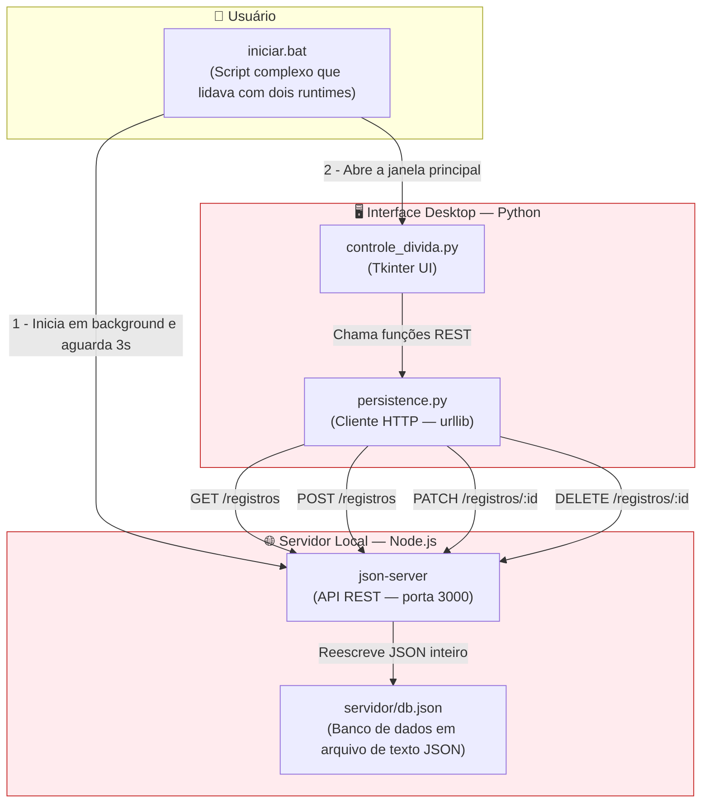
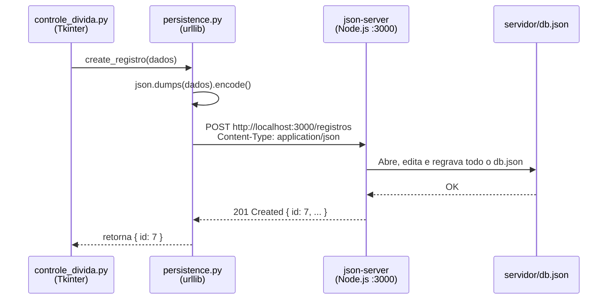

# Arquitetura Legado (V1) — Híbrida Python + Node.js

> **⚠️ AVISO:** Este documento representa uma arquitetura **descontinuada**. O projeto foi migrado com sucesso para uma solução 100% Python nativa (veja [Arquitetura Atual](arquitetura-atual.md)). Mantemos este documento como histórico arquitetural para explicar os motivos da migração.

---

## 🛑 Por que decidimos migrar? (Os problemas da V1)

A primeira versão deste projeto utilizava **Python para a interface gráfica** e **Node.js (com json-server) para a persistência de dados**, estabelecendo uma comunicação HTTP local entre os dois.

Apesar de ser uma prova de conceito rápida, a arquitetura híbrida provou ser problemática a longo prazo pelos seguintes motivos:

1. **Lentidão nas Requisições:** Cada interação do usuário (`Salvar`, `Carregar`, `Deletar`) exigia construir uma requisição HTTP, trafegar pela rede local (`localhost:3000`), ser interpretada pelo Node.js, ler/sobrescrever o arquivo `db.json` e devolver o JSON. O tempo por operação girava em torno de `100-200ms`. Na nova versão com SQLite nativo, isso caiu para `~3ms`.
2. **Setup Complexo (Experiência do Usuário Ruim):** Para usar um aplicativo desktop simples, o usuário era obrigado a ter **Python**, **Node.js** e um gerenciador de pacotes (`npm` ou `pnpm`) instalados na máquina, sem falar no tempo e espaço gastos baixando a pasta `node_modules` localmente.
3. **Risco de Corrupção de Dados:** O `json-server` funciona lendo e reescrevendo o arquivo JSON inteiro a cada alteração. Numa queda de energia ou fechamento abrupto, o arquivo poderia se corromper totalmente. SQLite (V2) resolve isso com **Transações ACID** de verdade.
4. **Script de Inicialização "Gambiarra":** O `iniciar.bat` precisava fazer "malabarismos" complexos para checar versões, abrir o terminal em background, esperar 3 segundos pro Node.js inicializar a porta e depois abrir a interface Python, além de precisar forçar o encerramento do processo (PID) na saída.

Esses pontos negativos nos fizeram concluir que **abandonar o Node.js em favor de uma integração direta Python + SQLite** seria o caminho mais sólido e profissional, sem alterar o funcionamento interno do front-end da aplicação. O ganho de performance e usabilidade foi brutal.

---

## 1. Visão Geral da Arquitetura Legada

Abaixo está o diagrama de como as peças se comunicavam antes da migração:

---

## 2. Fluxo de Dados Legado — Registrar um Pagamento

No fluxo antigo, havia muitos passos intermediários para apenas escrever algo no disco:

> Com a nova arquitetura, o fluxo de `persistence.py` até o banco se reduziu a uma única chamada SQL direta pelo motor C do `sqlite3`, eliminando toda a infraestrutura `Node.js`.
